# Whimsy Hollow

> A cozy hidden-object game for tired adults and kids. No timer. Just tiny treasures.
>
>    [](https://whimsy-hollow.vercel.app)
>
> Whimsy Hollow is a hand-painted hidden-object game built in [Phaser 3](https://phaser.io) and packaged as a desktop app with [Tauri](https://tauri.app). Search 59 cozy scenes, solve 5 story cases, find hidden spirits, and decorate your office between visits.
>
> ## Scene Gallery
>
> | | | |
> |---|---|---|
> | 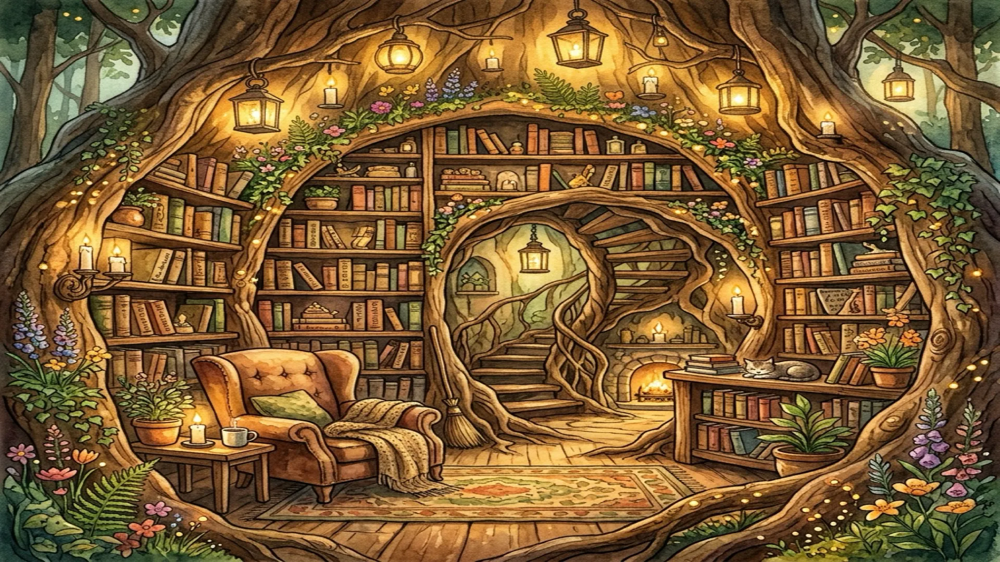 | 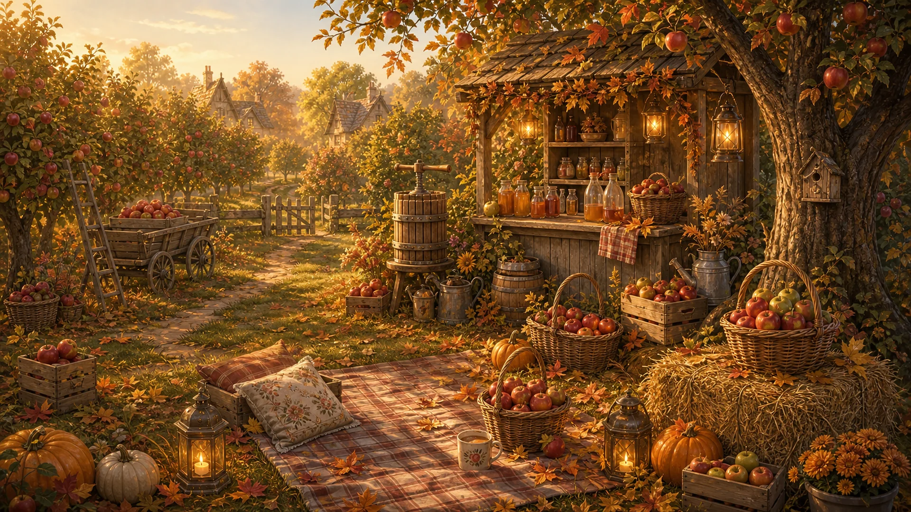 | 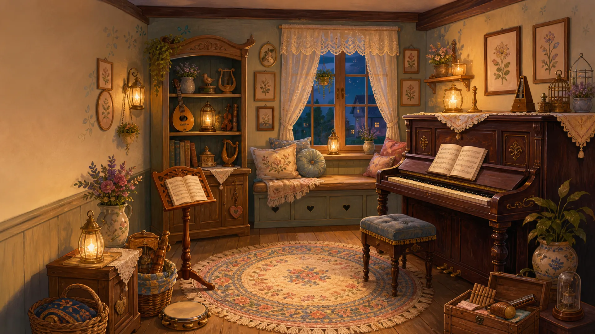 |
> | **Forest Bookshop** | **Autumn Apple Orchard** | **Candlelit Music Parlor** |
> | 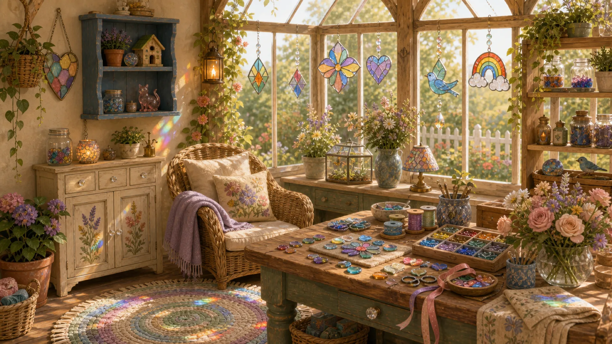 | 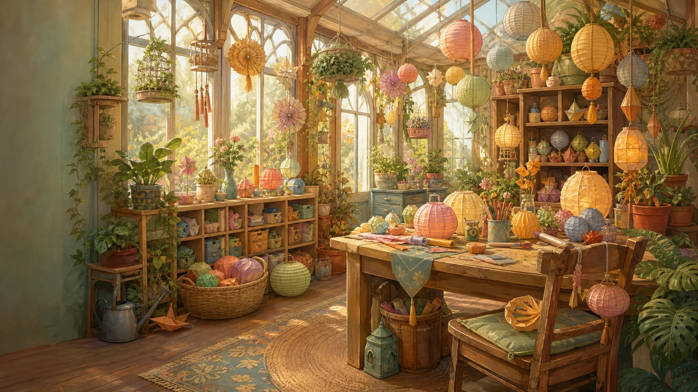 | 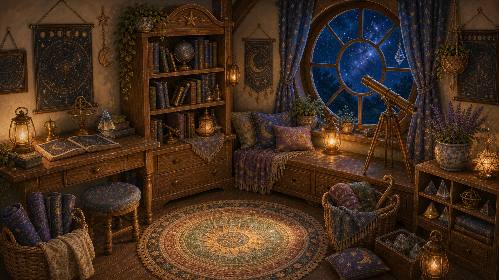 |
> | **Rainbow Glass Sunroom** | **Lantern Paper Conservatory** | **Starlight Observatory Nook** |
> | 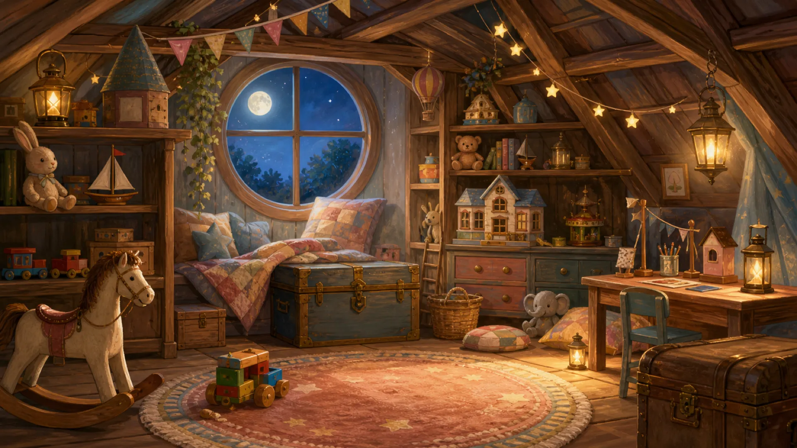 | 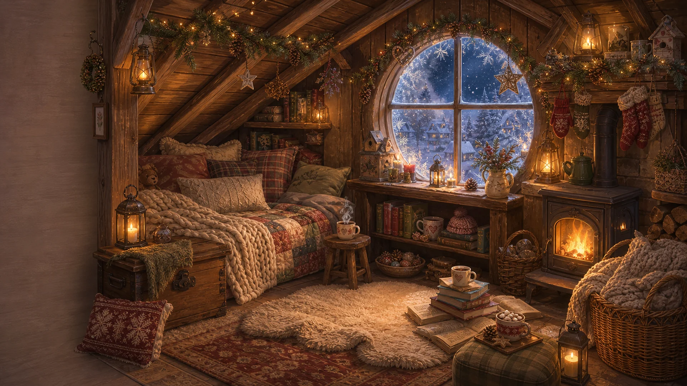 | 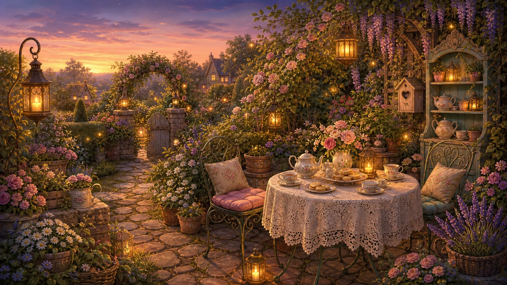 |
> | **Moonlit Toy Attic** | **Snowy Cabin Loft** | **Twilight Tea Garden** |
> | 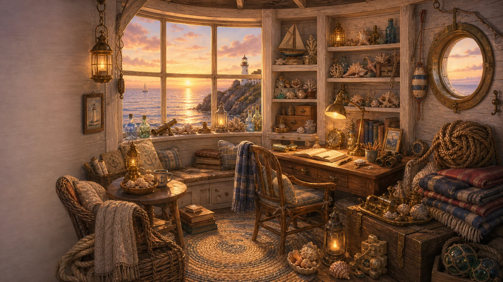 | 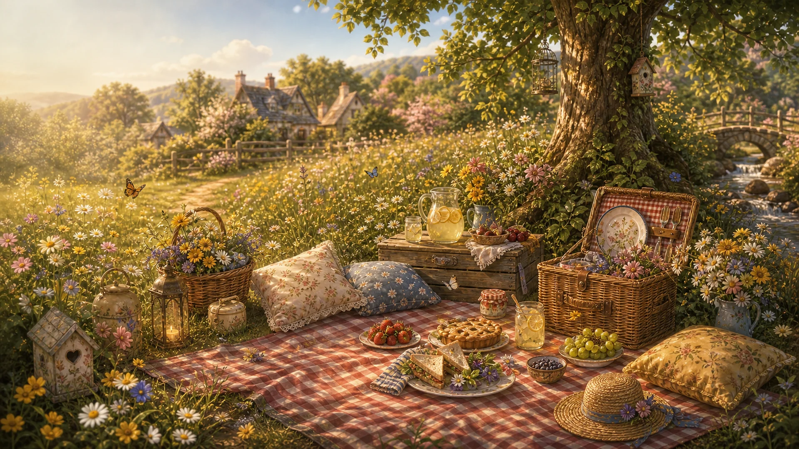 | 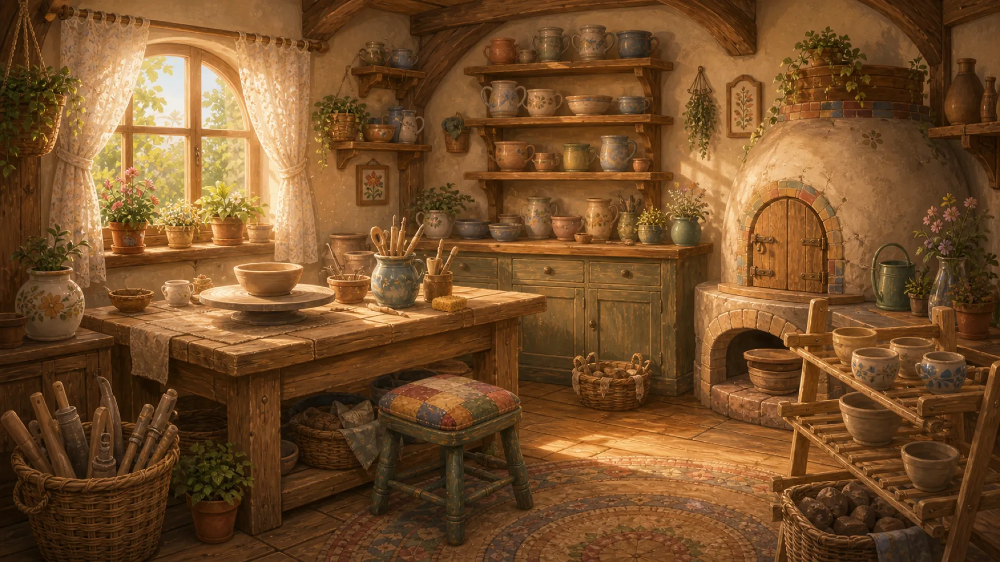 |
> | **Seaside Lighthouse** | **Spring Meadow Picnic** | **Sunbeam Pottery Studio** |
>
> *59 hand-painted scenes total — each one a cozy world to explore.*
>
> ## Features
>
> - **No timer, no fail state.** Tap at your own pace.
> - - **5 story cases** with sub-scenes, riddles, spirits, and optional bonus objectives.
>   - - **54 additional cozy places** to explore.
>     - - **Collectible spirits** hidden throughout each scene.
>       - - **Office decoration system** — furnish and customize your space between sessions.
>         - - **Original hand-painted art** with warm, cozy aesthetics.
>           - - **Cross-platform desktop app** via Tauri (Windows, macOS, Linux).
>             - - **3 save slots** — share the hollow with the whole household.
>               - - **Accessibility built-in** — colorblind filters, high-contrast outlines, keyboard pointer, reduced motion.
>                
>                 - ## Tech Stack
>                
>                 - | Tool | Purpose |
>                 - |---|---|
>                 - | Phaser 3 | Game engine — 59 independent scenes, camera, and audio bus |
> | Tauri 2 | Desktop wrapper — ships on Windows, macOS, and Linux |
> | TypeScript / JavaScript | Game logic, scene modules, and UI components |
>
> ## What This Code Shows
>
> - **Phaser 3 scene graph** — 59 independent scenes registered and hot-switched with zero reload
> - - **Campaign state machine** — hero-level controller tracks case completion across 5 nested story arcs
>   - - **Save system** — 3 independent save slots using structured localStorage with migration guards
>     - - **Tauri desktop packaging** — same codebase ships as a Vercel web build and a native Tauri 2 app
>       - - **Accessibility layer** — colorblind filters, high-contrast outlines, keyboard pointer, reduced-motion mode
>        
>         - ## Live Demo
>        
>         - [whimsy-hollow.vercel.app](https://whimsy-hollow.vercel.app)
>        
>         - ## Project Structure
>
> ```
> src/
>   main.js                      # Phaser bootstrap + scene registry
>   scenes/                      # Loading, Menu, Browse, Campaign, Game, Win, Hub, Pause, Settings
>   data/
>     levels.js                  # registry of all 59 levels
>     campaign.js                # 5 story cases
>     storage.js                 # save slots, settings, progress
>   game/HeroLevelController.js  # hero-level systems
>   ui/                          # buttons, theme, backdrop
>   audio/                       # music + sfx
> public/assets/
>   backgrounds/                 # 59 hand-painted .webp scene backgrounds
>   objects/                     # hidden object PNGs per scene
>   characters/                  # spirit and decoration assets
> src-tauri/                     # desktop shell config
> ```
>
> ## Run from Source
>
> ```bash
> npm install
> npm run dev          # browser dev build at http://127.0.0.1:5173
> npm run build        # production build into dist/
> npm run tauri:dev    # native desktop dev shell (requires Rust toolchain)
> npm run tauri:build  # ship-ready desktop bundle
> ```
>
> Single player. Offline. No telemetry. No microtransactions. ESRB Everyone / PEGI 3.
>
> ## License
>
> MIT (c) Sonny May
> 
> ## Contributing
>
> Bug reports and suggestions are welcome — please open an issue with the scene, platform, and steps to reproduce.
